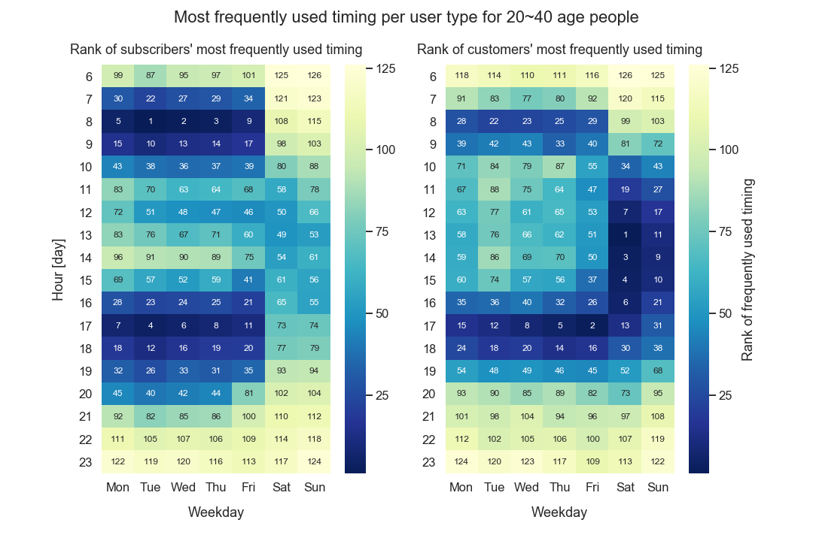
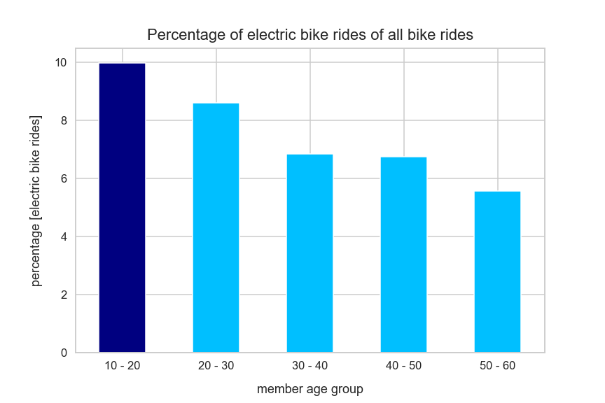
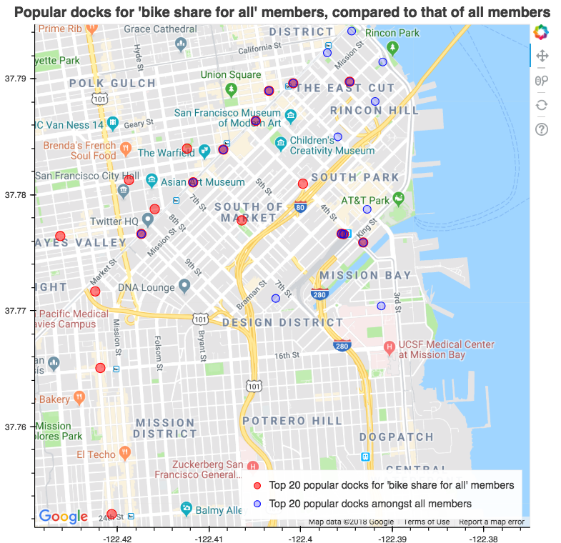
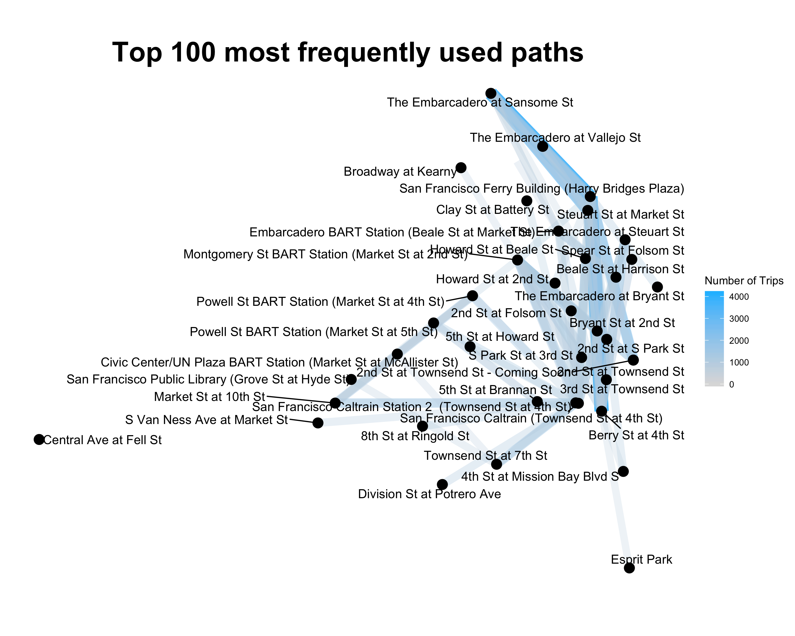

## Bike sharing analysis with Ford GoBike data
### Overview
I worked for a starup and participated in building customized service of Uber or Lyft to South Korea market. 
Since then, I have built a strong curiosity and passion to the mobility market.

In early July 2018, Lyft annouced the acquisition of Motivate (with $250 million), that operates bikeshare systems across New York(Citi Bike), Chicago(Divvy), D.C(Captical Bikeshare), and Boston(BlueBikes) and San Francisco Bay area(Ford GoBike). I live around San Francisco, not to mention that I was intrigued to Ford GoBike service.

Since Lyft might try to connect bike rides to their car rides, I wanted to think of how to implement the idea of integration of two different mobility service. So, I became curious on main user groups characteristics, the purpose of using the service, and popular routes.

In addition, there was another announcement on April 24th 2018 that Ford GoBike would do a pilot launch of their electric bike service. So, I would like to find who might be especially interested of the news.

My code is avilable in the following link [jupyter notebook](https://github.com/juliaYi/Data-Visualization/blob/master/Ford%20goBike%20data%20Analysis/ford_bike_data_analysis.ipynb) 

### Data 
This project used the following dataset, which are available in  (**Datasource**: [Ford goBike](https://s3.amazonaws.com/fordgobike-data/index.html) )   
And you can check the merged data from  [**Here**](https://github.com/juliaYi/Data-Visualization/tree/master/Ford%20goBike%20data%20Analysis/dataset).
**The dataset is a huge file so I compressed the file. So, before running my analysis, you should decompress the file.**

|Column Name|Number of Rows|Explanation|
|--|:--:|--:|
|`bike_id`|1,538,086|This dataset doesn't have 'user_id'|
|`duration_sec`|1,538,086|Trip duration recorded in second|
|`end_station_id`|1,532,841|There are some dockless rides|
|`end_station_latitude`|1,538,086||
|`end_station_longitude`|1,538,086||
|`end_station_name`|1,532,841|There are some dockless rides|
|`end_time`|1,538,086||
|`start_station_id`|1,532,841|There are some dockless rides|
|`start_station_latitude`|1,538,086||
|`start_station_longitude`|1,538,086||
|`start_station_name`|1,532,841|There are some dockless rides|
|`start_time`|1,538,086||
|`bike_share_for_all_trip`|1,018,386|This service started on Jan 2018|
|`user_type`|1,538,086 |Either subscriber or single-rider|
|`member_gender`|1,018,386|This has some missing values|
|`member_birth_year`|1,538,086 |No missing value|                   

### Tech Stacks
The project is mainly written in Python 3.6. I used pandas and numpy for data analysis, and used seaborn, and matplotlib for data visualization.
In addition, Some plots are plotted in R with Ipython, such as Bokeh and gglot2.
```
from requests import get
from os import path, getcwd, makedirs, listdir 
from io import BytesIO
from zipfile import ZipFile
import pandas as pd
import numpy as np
import matplotlib
from matplotlib import pyplot as plt
import matplotlib.ticker as tick
import seaborn as sns
import datetime
import math
import calendar
import cufflinks as cf

import warnings
warnings.filterwarnings('ignore')

from IPython.display import Image

from bokeh.io import output_file, show, output_notebook
from bokeh.models import ColumnDataSource, GMapOptions
from bokeh.plotting import gmap, figure

%matplotlib inline
%load_ext rpy2.ipython
```
### Highlights 
**1. How does subscibers and customers behave differently?**
>Subscribers' rides take place around both morning commute time and evening commute time. On the contrary, customers' rides take place the most during weekend, which represents the main purpose for the user type is different. The former is for convenience around commute time and the latter is more likely for leisure.

  

**2. Which age group favors e-bike more?**
>Suprisingly, 10 to 20 years user group seems to show the most interest in the e-bike, seeing that the percentage of e-bike rides of all the rides by 10 to 20 years old users is around 10%. Also, the younger a rider is, the more likely the rider would be fond of electric bike rides.

  

**3. What are the most popular docks for 'Bike share for all' members?**
>'Bike share for all' program is a subscription model for low income bay area residents. Unlike most popular docks for all members gathered around financial distinct and market street, the popular docks for 'Bike share for all' members are sqreaded especially around bart station or caltrain station, even though those are quite further away from market street, such as 24th street bart station. I guess it's because low income people tend to travel further from south bay or east bay and they might take public transportation to work around San Fancisco area. 

   

**4. Top 100 most frequently used paths**
>The 100 paths of all bike rides show that most rides happened around SOMA(South of Market), such as Embarcadero street, market street and townsend street. In addition to this, it is noticable that there are a lot of rides around bart station and Caltrain station as well. The top paths shows that people take bike rides from station, such as Bart or Caltrain, to where lots of companies are located. Also, traffic between market street implicitly shows that people take bike to go to restaurants around lunch time as well.

   
